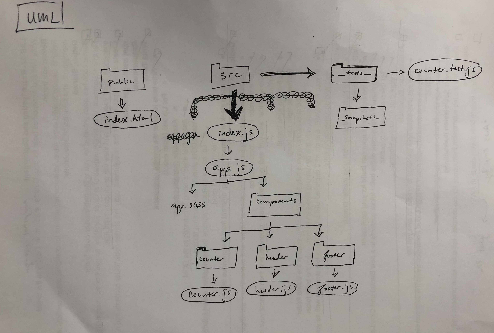

# LAB - React Testing and Deployment

## Lab 27

### Author: Julie Erlemeier

### Links and Resources
* [submission PR](https://github.com/jmerlemeier-401-advanced-javascript/snapshot-testing/pull/3)
* [travis](https://www.travis-ci.com/jmerlemeier-401-advanced-javascript/snapshot-testing)
* [AWS S3 Bucket](http://snapshot-testing27.s3-website-us-west-2.amazonaws.com/#)
* [AWS Amplify](https://deployment.d34ebk4wv8gprb.amplifyapp.com/)
* [Netlify](https://wizardly-bassi-1fcb57.netlify.com/)

#### Documentation
* [Netlify](https://docs.netlify.com/?_ga=2.57866153.2017287062.1574207646-1424901283.1574207646)
* [AWS S3 Bucket](https://docs.aws.amazon.com/s3/index.html)
* [AWS Amplify](https://docs.aws.amazon.com/amplify/latest/userguide/one-click.html)
* [SASS](https://sass-lang.com/)

### Setup
* See `package.json` for dependencies
* `npm install`

#### Running the app
* `npm start`
  
#### Tests
* How do you run tests?
  * `npm run counter.test.js`
  * `npm run lint`

#### UML
